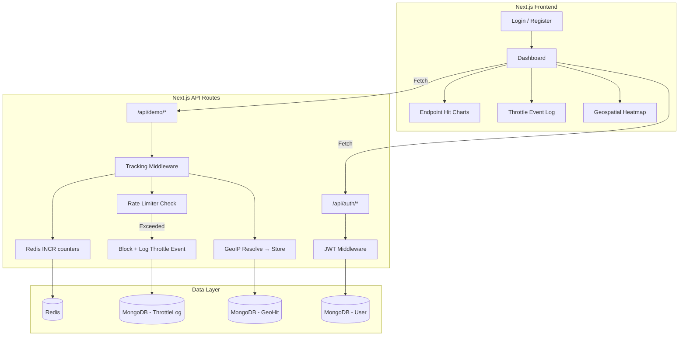

# API Analytics Dashboard — Implementation Plan

A full-stack Next.js application that tracks API endpoint usage, provides visual analytics, implements dynamic IP-based throttling via Redis, and displays a global geospatial heatmap of API traffic origins.

## Tech Stack

| Layer | Technology |
|---|---|
| Framework | Next.js (App Router, JavaScript) |
| UI Components | shadcn/ui + Tailwind CSS |
| Charts | Recharts (via shadcn/ui chart primitives) |
| Heatmap | Leaflet + `leaflet.heat` (dynamic import, SSR-safe) |
| Database | MongoDB (via Mongoose) |
| Cache / Tracking | Redis (via `ioredis`) |
| Auth | JWT (`jsonwebtoken` + `bcryptjs`) |
| IP Geolocation | `geoip-lite` (local MaxMind DB, zero API calls) |

---

## Architecture Overview



### How It Works

1. **Demo API endpoints** (`/api/demo/users`, `/api/demo/products`, `/api/demo/orders`) serve as sample APIs that users can hit to generate tracking data.
2. **Tracking middleware** intercepts every demo API call:
   - Increments a Redis counter per endpoint (`api:hits:<endpoint>`)
   - Increments a Redis counter per IP (`api:ip:<ip>`)
   - Resolves IP → lat/lng via `geoip-lite` and stores in MongoDB
3. **Rate limiter** uses a sliding window in Redis. If an IP exceeds the threshold (e.g., 50 requests/minute), it auto-blocks and logs the event to MongoDB.
4. **Dashboard** fetches aggregated data and renders charts, tables, and a world heatmap.

---

## Project Structure

```
c:\Users\Hp\OneDrive\Desktop\proj\
├── .env.local                    # Environment variables
├── jsconfig.json                 # Path aliases
├── next.config.mjs               # Next.js config
├── package.json
├── src/
│   ├── app/
│   │   ├── layout.js             # Root layout (fonts, providers)
│   │   ├── globals.css           # Tailwind + shadcn theme
│   │   ├── page.js               # Landing / redirect to dashboard
│   │   ├── login/
│   │   │   └── page.js           # Login page
│   │   ├── register/
│   │   │   └── page.js           # Register page
│   │   ├── dashboard/
│   │   │   └── page.js           # Main dashboard (protected)
│   │   └── api/
│   │       ├── auth/
│   │       │   ├── register/route.js
│   │       │   ├── login/route.js
│   │       │   └── me/route.js
│   │       ├── demo/
│   │       │   ├── users/route.js
│   │       │   ├── products/route.js
│   │       │   └── orders/route.js
│   │       └── analytics/
│   │           ├── hits/route.js       # GET aggregated hit counts
│   │           ├── geo/route.js        # GET geospatial data
│   │           ├── throttle-logs/route.js  # GET throttle events
│   │           └── timeline/route.js   # GET time-series data
│   ├── components/
│   │   ├── ui/                   # shadcn components (auto-generated)
│   │   ├── dashboard/
│   │   │   ├── StatsCards.js     # KPI stat cards
│   │   │   ├── HitsChart.js     # Bar chart of endpoint hits
│   │   │   ├── TimelineChart.js  # Line chart of traffic over time
│   │   │   ├── ThrottleTable.js  # Table of blocked IPs
│   │   │   ├── GeoHeatmap.js    # Leaflet world heatmap
│   │   │   └── ApiTester.js     # Quick-fire buttons to hit demo APIs
│   │   └── Navbar.js            # Top navigation bar
│   ├── lib/
│   │   ├── mongodb.js           # Mongoose connection singleton
│   │   ├── redis.js             # ioredis connection singleton
│   │   ├── auth.js              # JWT sign/verify helpers
│   │   └── rateLimit.js         # Sliding window rate limiter
│   ├── middleware.js             # Next.js middleware (auth guard)
│   └── models/
│       ├── User.js              # User schema (email, password hash)
│       ├── GeoHit.js            # Geospatial hit schema (lat, lng, ip, endpoint, timestamp)
│       └── ThrottleLog.js       # Throttle event schema (ip, reason, timestamp)
```

---

## Proposed Changes — File by File

### 1. Project Initialization & Configuration

#### [NEW] Project scaffold
- Run `npx create-next-app@latest ./ --js --tailwind --eslint --app --src-dir --import-alias "@/*"` in the project directory
- Run `npx shadcn@latest init` to configure shadcn/ui
- Add shadcn components: `button`, `card`, `input`, `label`, `table`, `badge`, `chart`, `separator`, `avatar`, `dropdown-menu`, `sonner` (toast)

#### [NEW] `.env.local`
```
MONGODB_URI=mongodb://localhost:27017/api-analytics
REDIS_URL=redis://localhost:6379
JWT_SECRET=your-super-secret-jwt-key-change-this
NEXT_PUBLIC_APP_URL=http://localhost:3000
```

#### [NEW] Dependencies to install
```bash
npm install mongoose ioredis jsonwebtoken bcryptjs geoip-lite leaflet react-leaflet leaflet.heat
```

---

### 2. Database & Cache Layer

#### [NEW] `src/lib/mongodb.js`
- Mongoose connection singleton using `MONGODB_URI` env var
- Caches connection across hot reloads in development

#### [NEW] `src/lib/redis.js`
- ioredis connection singleton using `REDIS_URL` env var
- Export a shared `redis` client instance

#### [NEW] `src/lib/auth.js`
- `signToken(userId)` — creates a JWT with 7-day expiry
- `verifyToken(token)` — verifies and decodes JWT
- `hashPassword(password)` — bcrypt hash
- `comparePassword(password, hash)` — bcrypt compare

#### [NEW] `src/lib/rateLimit.js`
- Implements a **sliding window** rate limiter using Redis sorted sets
- `checkRateLimit(ip)` — returns `{ allowed: boolean, remaining: number, total: number }`
- Window: 60 seconds, limit: 50 requests per IP
- On violation: logs to MongoDB `ThrottleLog` collection and adds IP to a Redis blocklist for 5 minutes

---

### 3. MongoDB Models

#### [NEW] `src/models/User.js`
```js
{ email: String, password: String, name: String, createdAt: Date }
```

#### [NEW] `src/models/GeoHit.js`
```js
{ ip: String, endpoint: String, lat: Number, lng: Number, city: String, country: String, timestamp: Date }
```

#### [NEW] `src/models/ThrottleLog.js`
```js
{ ip: String, endpoint: String, reason: String, blockedUntil: Date, city: String, country: String, timestamp: Date }
```

---

### 4. API Routes

#### [NEW] `src/app/api/auth/register/route.js`
- POST: validate input → hash password → save User → return JWT

#### [NEW] `src/app/api/auth/login/route.js`
- POST: validate credentials → compare hash → return JWT

#### [NEW] `src/app/api/auth/me/route.js`
- GET: verify JWT from cookie → return user profile

#### [NEW] `src/app/api/demo/users/route.js`, `products/route.js`, `orders/route.js`
- Each returns mock JSON data
- **Before response**: calls tracking logic:
  1. Check if IP is in Redis blocklist → return 429 if blocked
  2. Run `checkRateLimit(ip)` → block if exceeded
  3. `INCR` Redis key `api:hits:<endpoint>`
  4. `INCR` Redis key `api:hits:timeline:<endpoint>:<hourBucket>`
  5. Resolve IP via `geoip-lite` → save `GeoHit` to MongoDB

#### [NEW] `src/app/api/analytics/hits/route.js`
- GET: read all `api:hits:*` keys from Redis → return `[{ endpoint, count }]`

#### [NEW] `src/app/api/analytics/geo/route.js`
- GET: query MongoDB `GeoHit` collection → aggregate by city/country → return coordinates + counts

#### [NEW] `src/app/api/analytics/throttle-logs/route.js`
- GET: query MongoDB `ThrottleLog` sorted by most recent → return list

#### [NEW] `src/app/api/analytics/timeline/route.js`
- GET: read `api:hits:timeline:*` keys from Redis → return time-series data for line charts

---

### 5. Middleware

#### [NEW] `src/middleware.js`
- Protects `/dashboard` routes: checks for JWT in cookies
- Redirects unauthenticated users to `/login`
- Allows `/api/auth/*`, `/login`, `/register`, and static assets through

---

### 6. Frontend Pages

#### [NEW] `src/app/layout.js`
- Root layout with Inter font from Google Fonts
- Dark theme by default
- Toaster provider (sonner)

#### [NEW] `src/app/page.js`
- Landing page with hero section → CTA to login/register

#### [NEW] `src/app/login/page.js`
- Clean card-based login form (email + password)
- Calls `/api/auth/login` → stores JWT in httpOnly cookie → redirects to `/dashboard`

#### [NEW] `src/app/register/page.js`
- Registration form (name, email, password)
- Calls `/api/auth/register` → same flow as login

#### [NEW] `src/app/dashboard/page.js`
- **Protected page** (middleware enforced)
- Layout: Navbar at top, then a grid of dashboard widgets
- Fetches data from all analytics API routes on mount
- Renders: `StatsCards`, `HitsChart`, `TimelineChart`, `ThrottleTable`, `GeoHeatmap`, `ApiTester`

---

### 7. Dashboard Components

#### [NEW] `src/components/Navbar.js`
- App title, user name, logout button
- Clean, minimal top bar

#### [NEW] `src/components/dashboard/StatsCards.js`
- 4 cards: Total Hits, Unique Endpoints, Blocked IPs, Countries Reached
- Uses shadcn `Card` component

#### [NEW] `src/components/dashboard/HitsChart.js`
- **Bar chart** (Recharts via shadcn chart) showing hits per endpoint
- Color-coded bars, tooltips on hover

#### [NEW] `src/components/dashboard/TimelineChart.js`
- **Line/area chart** showing API traffic over time (hourly buckets)
- Multiple lines for different endpoints

#### [NEW] `src/components/dashboard/ThrottleTable.js`
- **Table** (shadcn Table) listing blocked/throttled IPs
- Columns: IP, Endpoint, City, Country, Blocked Until, Timestamp
- Badge for status (active block vs expired)

#### [NEW] `src/components/dashboard/GeoHeatmap.js`
- **Leaflet map** with heatmap layer (dynamically imported, SSR-safe)
- Dark-themed map tiles (CartoDB dark_all)
- Plots API request origins as heat intensity
- Zoom-capable, interactive

#### [NEW] `src/components/dashboard/ApiTester.js`
- Panel with 3 buttons: "Hit /users", "Hit /products", "Hit /orders"
- Plus a "Burst (50 requests)" button to trigger throttling
- Shows response status in real-time
- Allows the user to generate traffic for demo purposes

---

## UI Design Direction

- **Theme**: Dark mode, minimal, monochromatic with accent color highlights
- **Typography**: Inter font, clean hierarchy
- **Layout**: Single-page dashboard with responsive CSS grid
- **Cards**: Subtle borders, no heavy shadows, glassmorphism-lite (slight transparency)
- **Charts**: Smooth gradients, rounded bar corners, subtle grid lines
- **Map**: Dark CartoDB tiles, warm-gradient heatmap (green → yellow → red)

---

## Open Questions

> [!IMPORTANT]
> **Redis & MongoDB availability**: This plan assumes you have Redis and MongoDB running locally. Do you have them installed, or should I configure Docker Compose to spin them up?

> [!NOTE]
> **Rate limit thresholds**: I've set defaults at 50 requests/minute per IP with a 5-minute block duration. Would you like different values?

> [!NOTE]
> **IP resolution in localhost**: When running locally, all requests will come from `127.0.0.1` or `::1`, so the geo heatmap won't show real locations. The `ApiTester` component will include a way to simulate different IPs for demo purposes. Is this acceptable?

---

## Verification Plan

### Automated Tests
1. **Build check**: `npm run build` — ensure zero errors
2. **Dev server**: `npm run dev` — verify all pages load
3. **API tests via browser**: Use the built-in `ApiTester` widget to:
   - Hit each demo endpoint and verify hit counters increase
   - Trigger burst mode to verify throttling kicks in
   - Check that throttle logs appear in the table

### Manual Verification
1. Register a new user → Login → Verify dashboard loads
2. Hit demo APIs → Verify bar chart updates
3. Trigger rate limit → Verify IP appears in throttle table with active badge
4. Check heatmap renders with simulated geo data
5. Verify responsive layout on different screen sizes
